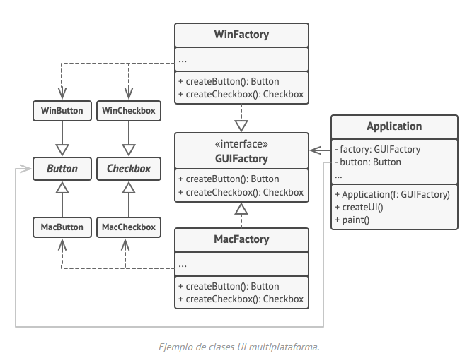
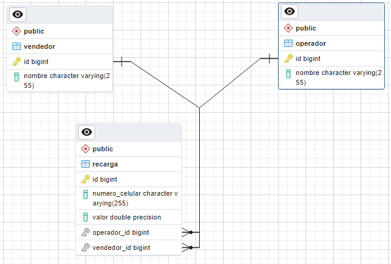

# data-center-assessment

***1. Defina los siguientes conceptos:***

* **Clase:** Es un tipo de dato definido por el desarrollador, que define el comportamiento y los datos de un objeto. Consta de atributos, métodos y constructores.
* **Objeto:** Es una instancia de una clase.
* **Herencia:** Es la capacidad de una clase para heredar los atributos y métodos de otra clase. La clase que hereda se llama subclase, y la clase de la que hereda se llama superclase.
* **Polimorfismo:** Se refiere a la capacidad de una clase para tomar varias formas. Se suele usar junto con implementaciones o abstracciones.
* **Sobrecarga:** Capacidad de definir múltiples métodos o constructores en una clase con el mismo nombre pero con diferentes parámetros.
* **Paquete:** Ayuda a organizar y estructurar el código fuente de un programa. Agrupa clases, interfaces, enums y subpaquetes relacionados.
* **Framework:** Es un entorno de trabajo que provee herramientas, bibliotecas y convenciones que proporcionan una estructura y una base para el desarrollo de software.

***2. Asumiendo que existe una clase publica llamada Apuesta con métodos public int getValorApuesta() y public void set ValorApuesta(int valor)***

```
public void encimarApuesta(){
    Apuesta apuesta = null;
    apuesta = crearApuesta(apuesta);
    System.out.println(apuesta.getValorApuesta());
}

public Apuesta crearApuesta(Apuesta apuesta){
    apuesta = new Apuesta();
    apuesta.setValorApuesta(1500);
    return apuesta;
}
```

El resultado de la línea en negrilla una vez ha sido ejecutado por completo el método encimarApuesta es: **1500**

***3. Para qué sirve el archivo MANIFEST.MF en una aplicación y donde está ubicado.***

* El archivo MANIFEST.MF es un archivo que se utiliza principalmente para aplicaciones empaquetadas con extensión```.jar```.
* El archivo puede contener información como: Versión de la aplicación, clase principal, clases y recursos del Classpath, dependencias y permisos de seguridad.
* Se encuentra en la carpeta META-INF dentro del archivo ```.jar```.

***4. En una aplicación JSF donde se definen las reglas de navegación y Backing Bean.***
 * Las reglas de navegación se definen generalmente en el archivo faces-config.xml. Este archivo se encuentra en el directorio WEB-INF del proyecto y contiene la configuración de la aplicación JSF, incluidas las reglas de navegación. 
 * Los Backing Beans, son clases de Java que actúan como controladores en una aplicación JSF. Estas clases suelen tener la anotación @ManagedBean o @Named y se asocian con páginas JSF.

***5. Si se requiere un filtro en la aplicación para que cada vez que se solicite una página se verifique que el usuario esté autenticado que archivos debería construir y cuales debería modificar.***

* Para Spring Security:
  * Crear una clase de configuración que extienda WebSecurityConfigurerAdapter para configurar Spring Security.
  * Crear una clase de configuración que permita protejer los endpoints requeridos, como:

```
@Configuration
@EnableWebSecurity
@RequiredArgsConstructor
public class SecurityConfig {

    private final JwtAuthFilter jwtAuthFilter;
    private final AuthenticationProvider authenticationProvider;

    @Bean
    public SecurityFilterChain securityFilterChain(HttpSecurity httpSecurity) throws Exception {

        httpSecurity
                .csrf(AbstractHttpConfigurer::disable)
                .authorizeHttpRequests(auth -> auth
                        .requestMatchers("api/v1/auth/**").permitAll()
                        .anyRequest().authenticated())
                .sessionManagement(session -> session
                        .sessionCreationPolicy(
                                SessionCreationPolicy.STATELESS)
                )
                .authenticationProvider(authenticationProvider)
                .addFilterBefore(jwtAuthFilter, UsernamePasswordAuthenticationFilter.class);


        return httpSecurity.build();
    }
}
```

* Para Java EE o Jakarta EE
  * Crear una clase que implemente la interfaz ```javax.servlet.Filter```
  * Configurar el filtro en el archivo ```web.xml``` o utilizando anotaciones ```@WebFilter```
  * Configurar el ```login-config``` en ```web.xml```
  * Proteger las paginas que estén dentro del patrón definido en la configuración de seguridad (por ejemplo, /protected/*) y que tengan las restricciones de seguridad configuradas.

***6. Mencione los 7 tipos de datos primitivos en Java***
```
byte, short, int, long, float, double, boolean, char.
```

***7.***
```
public static void main(String[] args){
    for(int i=0; i < =10; i++){
        if (i > 6) break;
    }
    System.out.println(i);
}
```

El resultado de la ejecución del código anterior es: **Compilación Fallida.**

***8. En J2EE que es un EJB. Mencione los principales tipos.***
* Un EJB es un componente de servidor que encapsula la lógica empresarial de una aplicación. Los EJBs proporcionan una forma estándar de implementar la lógica en aplicaciones empresariales distribuidas y gestionan aspectos como la transaccionalidad, la concurrencia y la persistencia de datos.
* Los principales tipos son:
  * Session Beans:
    * Stateless Session Bean (SLSB)
    * Stateful Session Bean (SFSB)
  * Message-Driven Beans (MDB)
  * Entity Beans

***9. En qué tipo de EJB se puede mapear una tabla de base de datos.***

Entity Beans, usando la anotación ```@Entity``` en la clase.

***10. Defina y de un escenario de aplicación de los siguientes patrones de diseño:***

* **Singletón:** Es un patrón de diseño creacional que nos permite asegurarnos de que una clase tenga una única instancia, a la vez que proporciona un punto de acceso global a dicha instancia.
    * **Escenario:** Se requiere manejar un objeto de conexión a un hardware, ya sea: impresora, lector barras o rfid, etc. El objeto garantizará que solo haya una instancia responsable de gestionar las operaciones y los recursos asociados.
* **Facade:** Es un patrón de diseño estructural que proporciona una interfaz simplificada a una biblioteca, un framework o cualquier otro grupo complejo de clases.
    * **Escenario:** Se requiere una clase que maneje conversión de links de youtube a formatos mp4, mp3, flac, etc. Se puede crear una clase ```YouTubeConverterFacade``` que simplifique y unifique la interfaz para la conversión de enlaces de YouTube a diferentes formatos.
* **Abstract Factory:** Es un patrón de diseño creacional que nos permite producir familias de objetos relacionados sin especificar sus clases concretas.
    * **Escenario:** El patrón Abstract Factory puede utilizarse para crear elementos de interfaz de usuario (UI) multiplataforma sin acoplar el código cliente a clases UI concretas, mientras se mantiene la consistencia de todos los elementos creados respecto al sistema operativo seleccionado.
      

***11. Se tienen las siguientes entidades:***
```
Empresa(Id_empresa, nombre_empresa)
Producto(Id_producto, nombre_producto)
Vendedor(Id_vendedor, num_documento, nombre, fk_id_empresa)
Venta(Id_venta, valor_total, fk_id_vendedor, fecha, fk_id_cliente)
DetalleVenta(id_detalle_venta, valor_total, fk_id_producto, cantidad, fk_id_venta)
```

Realizar una consulta SQL que muestre la información de la siguiente manera:

|Empresa |Producto |Cantidad |Valor Total|
| ------------- | ------------- | ------------- | ------------- |

Para motor PostgreSQL:

* Creación de tablas:
```
CREATE TABLE Empresa (
    Id_empresa SERIAL PRIMARY KEY,
    nombre_empresa VARCHAR(100)
);

CREATE TABLE Producto (
    Id_producto SERIAL PRIMARY KEY,
    nombre_producto VARCHAR(100)
);

CREATE TABLE Vendedor (
    Id_vendedor SERIAL PRIMARY KEY,
    num_documento VARCHAR(20),
    nombre VARCHAR(100),
    fk_id_empresa INTEGER REFERENCES Empresa(Id_empresa)
);

CREATE TABLE Venta (
    Id_venta SERIAL PRIMARY KEY,
    valor_total DECIMAL(10, 2),
    fk_id_vendedor INTEGER REFERENCES Vendedor(Id_vendedor),
    fecha DATE,
    fk_id_cliente INTEGER
);

CREATE TABLE DetalleVenta (
    id_detalle_venta SERIAL PRIMARY KEY,
    valor_total DECIMAL(10, 2),
    fk_id_producto INTEGER REFERENCES Producto(Id_producto),
    cantidad INTEGER,
    fk_id_venta INTEGER REFERENCES Venta(Id_venta)
);
```
* Inserción de data de prueba:
```
INSERT INTO Empresa (nombre_empresa) VALUES
    ('Empresa A'),
    ('Empresa B');

INSERT INTO Producto (nombre_producto) VALUES
    ('Producto 1'),
    ('Producto 2');

INSERT INTO Vendedor (num_documento, nombre, fk_id_empresa) VALUES
    ('123456789', 'Vendedor 1', 1),
    ('987654321', 'Vendedor 2', 2);

INSERT INTO Venta (valor_total, fk_id_vendedor, fecha, fk_id_cliente) VALUES
    (100.00, 1, '2023-01-01', 1),
    (150.00, 2, '2023-02-01', 2);

INSERT INTO DetalleVenta (valor_total, fk_id_producto, cantidad, fk_id_venta) VALUES
    (50.00, 1, 2, 1),
    (75.00, 2, 3, 2);
```
* Selección de la data requerida:
```
SELECT
    E.nombre_empresa AS Empresa,
    P.nombre_producto AS Producto,
    DV.cantidad AS Cantidad,
    DV.valor_total AS "Valor Total"
FROM
    Empresa E
JOIN
    Vendedor V ON E.Id_empresa = V.fk_id_empresa
JOIN
    Venta Vn ON V.Id_vendedor = Vn.fk_id_vendedor
JOIN
    DetalleVenta DV ON Vn.Id_venta = DV.fk_id_venta
JOIN
    Producto P ON DV.fk_id_producto = P.Id_producto;
```

***12. Escriba un procedimiento almacenado o aplicación Java que consolide los totales de venta del punto anterior, garantizando tener solo los últimos 6 meses en dicho consolidado.***

Store procedure:
```
CREATE
OR REPLACE FUNCTION ConsolidarVentasUltimos6Meses()
RETURNS TABLE (
Empresa VARCHAR,
Producto VARCHAR,
Cantidad INT,
ValorTotal NUMERIC
) AS $$
BEGIN
RETURN QUERY
SELECT E.nombre_empresa    AS Empresa,
       P.nombre_producto   AS Producto,
       SUM(DV.cantidad)    AS Cantidad,
       SUM(DV.valor_total) AS ValorTotal
FROM Empresa E
         JOIN
     Vendedor V ON E.Id_empresa = V.fk_id_empresa
         JOIN
     Venta Vt ON V.Id_vendedor = Vt.fk_id_vendedor
         JOIN
     DetalleVenta DV ON Vt.Id_venta = DV.fk_id_venta
         JOIN
     Producto P ON DV.fk_id_producto = P.Id_producto
WHERE Vt.fecha >= CURRENT_DATE - INTERVAL '6 months'
GROUP BY
    E.nombre_empresa, P.nombre_producto;

RETURN;
END;
$$
LANGUAGE plpgsql;
```
Uso:

```
SELECT * FROM ConsolidarVentasUltimos6Meses();
```

***13. Para qué sirve el entityManager y cuáles son los métodos básicos que este provee.***

La API de EntityManager se utiliza para crear y eliminar instancias de entidad persistentes, para encontrar entidades por su clave primaria y para realizar consultas sobre entidades. El conjunto de entidades que puede gestionar una instancia específica de EntityManager está definido por una unidad de persistencia. Una unidad de persistencia define el conjunto de todas las clases que están relacionadas o agrupadas por la aplicación y que deben estar ubicadas en su mapeo hacia una única base de datos.

* Métodos básicos:
  * ```persist(Object entity)```
  * ```merge(Object entity)```
  * ```remove(Object entity)```
  * ```find(Class<T> entityClass, Object primaryKey)```
  * ```createQuery(String qlString)```
  * ```flush()```
  * ```clear()```
  * ```refresh(Object entity)```

***14. Escriba 3 formas diferentes de recorrer un arreglo usando el lenguaje Java.***

* Por medio de un bucle for convencional.
* Por medio de un bucle forEach.
* Convirtiendo el arreglo a un iterador y utilizando el bucle while de la forma: ``` while (iterador.hasNext()) ```

***15. Qué es un patrón de diseño.***

* Los patrones de diseño son soluciones habituales a problemas que ocurren con frecuencia en el diseño de software. Son como planos prefabricados que se pueden personalizar para resolver un problema de diseño recurrente en tu código.
* No se puede elegir un patrón y copiarlo en el programa como si se tratara de funciones o bibliotecas ya preparadas. El patrón no es una porción específica de código, sino un concepto general para resolver un problema particular. Puedes seguir los detalles del patrón e implementar una solución que encaje con las realidades de tu propio programa.

***16. Construya un XML que defina una estructura jerárquica para Países, Departamentos, Ciudades y Barrios.***

```
<?xml version="1.0" encoding="UTF-8"?>
<geografia>
    <pais nombre="Argentina">
        <departamento nombre="Buenos Aires">
            <ciudad nombre="Buenos Aires">
                <barrio nombre="Palermo"/>
                <barrio nombre="Recoleta"/>
            </ciudad>
            <ciudad nombre="La Plata">
                <barrio nombre="Centro"/>
                <barrio nombre="Gonnet"/>
            </ciudad>
        </departamento>
        <departamento nombre="Córdoba">
            <ciudad nombre="Córdoba">
                <barrio nombre="Nueva Córdoba"/>
                <barrio nombre="Alberdi"/>
            </ciudad>
        </departamento>
    </pais>
    <pais nombre="Brasil">
        <departamento nombre="Sao Paulo">
            <ciudad nombre="Sao Paulo">
                <barrio nombre="Jardins"/>
                <barrio nombre="Moema"/>
            </ciudad>
        </departamento>
        <departamento nombre="Rio de Janeiro">
            <ciudad nombre="Rio de Janeiro">
                <barrio nombre="Copacabana"/>
                <barrio nombre="Ipanema"/>
            </ciudad>
        </departamento>
    </pais>
</geografia>
```

***17. Se requiere de una aplicación web (Angular, JSF) por medio de la cual se puedan vender recargas en línea. Se debe poder identificar en cualquier momento la cantidad y valor de recargas discriminada por operator (Tigo, Movistar, Comcel, Uff) y persona que realiza la venta.***

* Implementar APIs necesarias en Spring boot (Opcional)
* Crear pantalla para la venta de recargas (no se requiere diseño)
* Realice un diagrama relacional, diagrama de casos de uso, diagrama de secuencia y de clases que sirva como solución para dicha implementación.
* Subir la solución a un repositorio GIT

Herramientas utilizadas para ejecución:

* PostgreSQL
* Intellij Ultimate
* Wildfly 30.0.1

Configuración para ejecución:

* Crear configuración para Wildfly server con el fin de correr el front JSF. Seleccionar ```jsf-assessment.war```
* Crear configuración para correr el API Springboot generada en el folder ```data-center-api```
* Crear BD ```assessment```. User BD configurado: postgres, Password: postgre. Realice los cambios pertinentes en ```application.yml``` 
* Luego de ejecutar servicio Spring una vez, crear usuarios y operadores en base de datos con:

```
INSERT INTO operator (name)
VALUES ('Tigo');

INSERT INTO operator (name)
VALUES ('Movistar');

INSERT INTO operator (name)
VALUES ('Comcel');

INSERT INTO operator (name)
VALUES ('Uff');
```

```
INSERT INTO seller (name)
VALUES ('Diego');

INSERT INTO seller (name)
VALUES ('Julian');
```

Ejecución:

* Iniciar servicio backend Springboot.
* Iniciar servicio Wildfly.
* Utilice los ID's generados en base de datos respecto a seller y operator para crear recargas en el front.

***Diagramas solicitados***

Diagrama Entidad-Relación:



Diagrama de casos de uso:

* --TODO--

Diagrama de secuencia

* --TODO--

Diagrama de clases:

* --TODO--

***Referencias***

[Patrones de diseño](https://refactoring.guru/es/design-patterns/what-is-pattern)